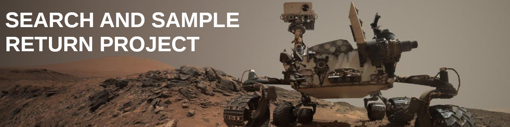
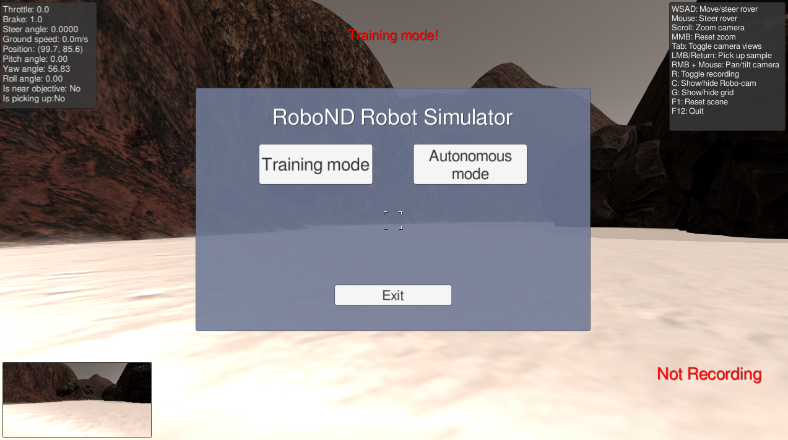
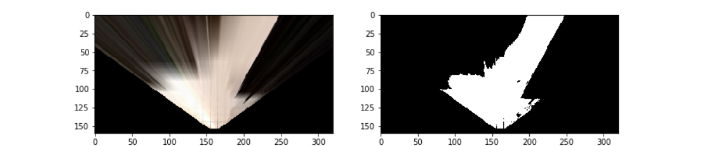
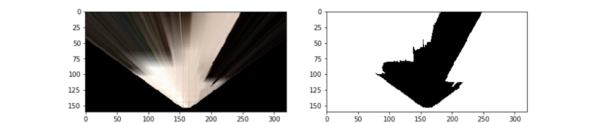
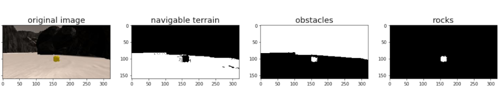
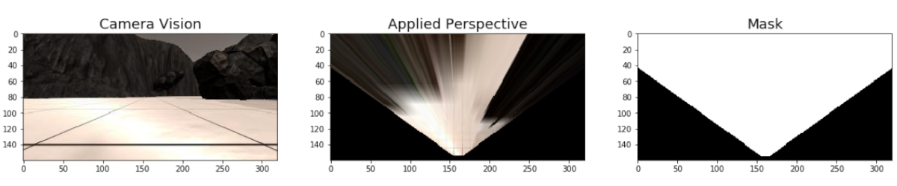
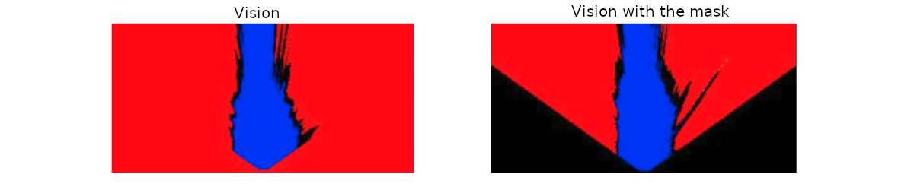
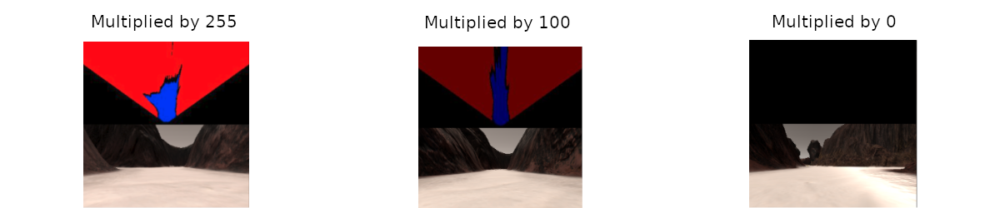

[](https://www.udacity.com/robotics)



# The Project
This project is modeled after the [NASA sample return challenge](https://www.nasa.gov/directorates/spacetech/centennial_challenges/sample_return_robot/index.html) and it will give you first hand experience with the three essential elements of robotics, which are perception, decision making and actuation.  You will carry out this project in a simulator environment built with the Unity game engine.  

### Project Goals

##### The objectives for this project are: 

* Write code to identify the difference between obstacles, rocks, and navigable terrain, for a robot that is in a simulated environment.
* Map each obstacle, rock, or navigable terrain that the robot perceives, adding them to the global map.
 * Make decisions based on the information that we have about our environment so we can navigate autonomously.
 
##### Project Rubric
* The rover must map at least 40% of the environment with 60% fidelity (accuracy) against the ground truth. You must also find (map) the location of at least one rock sample.

 
 
# ¿What Do You Need To Start?
 
#### Getting The Files And The Code
First, you can fork or download the original code [here](https://github.com/udacity/RoboND-Rover-Project.git)	 

#### Get the Simulator
The next step, is to download the simulator.  Here are the links for [Linux](https://s3-us-west-1.amazonaws.com/udacity-robotics/Rover+Unity+Sims/Linux_Roversim.zip), [Mac](	https://s3-us-west-1.amazonaws.com/udacity-robotics/Rover+Unity+Sims/Mac_Roversim.zip), or [Windows](https://s3-us-west-1.amazonaws.com/udacity-robotics/Rover+Unity+Sims/Windows_Roversim.zip).  

You can test out the simulator by opening it up and choosing "Training Mode".  Use the mouse or keyboard to navigate around the environment and see how it looks.



##### Manual Controls
Experiment in `Training Mode` with the various manual functions.

   * Throttle, brake and steering: `wsad` letters or `arrow keys` (can also steer with mouse)
   * Toggle mouse function between camera perspective and steering: `esc key` - change the viewing perspective: `Tab key` or mouse
   * Change zoom on the viewing camera: `mouse scroll`
   * Reset viewing camera zoom: `middle mouse` button (MMB)
   * Activate the robot arm to pick up a sample: `left mouse button` (LMB) or `enter key` (only works when is near objective = yes)


#### Dependencies
[image_2]: ./misc/dependencies.png
![alt text][image_2]

You'll need Python 3 and Jupyter Notebooks installed to do this project.  The best way to get setup with these if you are not already is to use Anaconda following along with the [RoboND-Python-Starterkit](https://github.com/ryan-keenan/RoboND-Python-Starterkit). 


# Project Explanation

#### Recording Data

I've saved some test data for you in the folder called `test_dataset`.  In that folder you'll find a csv file with the output data for steering, throttle position etc. and the pathnames to the images recorded in each run.  I've also saved a few images in the folder called `calibration_images` to do some of the initial calibration steps with.  

The first step of this project is to record data on your own.  To do this, you should first create a new folder to store the image data in.  Then launch the simulator and choose `Training Mode` then hit "r".  Navigate to the directory you want to store data in, select it, and then drive around collecting data.  Hit "r" again to stop data collection.

[image_3]: ./misc/recording.png
![alt text][image_3]

#### Data Analysis
Included in the IPython notebook called `Rover_Project_Test_Notebook.ipynb` are the functions from the lesson for performing the various steps of this project.  The notebook should function as is without need for modification at this point.  To see what's in the notebook and execute the code there, start the jupyter notebook server at the command line like this:

```sh
jupyter notebook
```

This command will bring up a browser window in the current directory where you can navigate to wherever `Rover_Project_Test_Notebook.ipynb` is and select it.  Run the cells in the notebook from top to bottom to see the various data analysis steps.  

The last two cells in the notebook are for running the analysis on a folder of test images to create a map of the simulator environment and write the output to a video.  These cells should run as-is and save a video called `test_mapping.mp4` to the `output` folder.  This should give you an idea of how to go about modifying the `process_image()` function to perform mapping on your data.  


#### Navigating Autonomously
The file called `drive_rover.py` is what you will use to navigate the environment in autonomous mode.  This script calls functions from within `perception.py` and `decision.py`.  The functions defined in the IPython notebook are all included in`perception.py` and it's your job to fill in the function called `perception_step()` with the appropriate processing steps and update the rover map. `decision.py` includes another function called `decision_step()`, which includes an example of a conditional statement you could use to navigate autonomously.  Here you should implement other conditionals to make driving decisions based on the rover's state and the results of the `perception_step()` analysis.

`drive_rover.py` should work as is if you have all the required Python packages installed. Call it at the command line like this: 

```sh
python drive_rover.py
```  
 
Then launch the simulator and choose "Autonomous Mode".  The rover should drive itself now!  It doesn't drive that well yet, but it's your job to make it better!  

# Project Instructions

##### Training / Calibration

* Download the files and the simulator, and take data in `Training Mode`
* Test out the functions in the `Jupyter Notebook` provided (`Rover_Project_Test_Notebook.ipyn`)
* Add functions to detect obstacles and samples of interest (golden rocks)
* Fill in the `process_image()` function with the appropriate image processing steps (`perspective transform`, `color threshold` etc.) to get from raw images to a map. The `output_image` you create in this step should demonstrate that your mapping pipeline works.
* Use `moviepy` to process the images in your saved dataset with the `process_image()` function. Include the video you produce as part of your submission.

##### Autonomous Navigation / Mapping

* Fill in the `perception_step()` function within the `perception.py` script with the appropriate image processing functions to create a map and update `Rover()` data (similar to what you did with `process_image()` in the notebook).
* Fill in the `decision_step()` function within the `decision.py` script with conditional statements that take into consideration the outputs of the `perception_step()` in deciding how to issue throttle, brake and steering commands.
* Iterate on your perception and decision function until your rover does a reasonable (need to define metric) job of navigating and mapping.


 
# My Solution

##### My analysis is divided into two parts:

* First, the **notebook analysis** that is where I test some of the functions that I will apply to the
Rover. 
* Next, the analysis where I mention what was modified in each of the files involved to achieve, and apply the **autonomous navigation**.
 
##### I used 3 tags to classify the changes that I did to the original functions: 

* `Original:`This tag means that the function was not changed.

* `Modified:`This tag means that I did a modification to an existing function.

* `Added:`This tag means that this function was created.

##### My Simulator settings  (Resolution and Graphics quality)

|    Name   |    Setting   | 
| ------------------------       |:-------------:| 
| Operating System     | Linux| 
| Screen Resolution     | 1280 x 720| 
| Graphics Quality     | Fantastic| 
| Frames | Approx 50fps| 


# Notebook Analysis
 
## [Rover_Project_Test_Notebook.ipynb](./code/Rover_Project_Test_Notebook.ipynb) 
 
#### color_thresh( ) `Original`

We use this function to identify the navigable terrain. I decided to use `RGB` values above `(160,160,160)` because they do a nice job identifying the ground pixels.



`The white color represents the terrain that the rover can navigate.`

#### obstacle_thresh( ) `Added`

This function is used to identify the obstacles. This is pretty much the same code that the `color_thresh` function but in this case, we are going to filter the values below the `RGB` threshold. Values below `(160,160,160)` are good enough to identify the obstacle pixels.




`The white color represents the obstacles.`

#### rock_thresh( ) `Added`

To identify the rocks I used the `cv.inRange`function. This function checks if array elements lie between the elements of two other arrays. For the lower value I used `(100, 100, 0)`, and for the upper value I used `(210, 210, 55)`.


In other words if we find an element between those two values, we can say that we found a rock.

```python
rock = cv2.inRange(img, lower_value, upper_value)
```

#### process_image( ) `Modified`

Here is where we call and apply all our functions of the `project_ test_ notebook`. 
First, we call the `perspect_transform` function, and we apply our functions to identify where do we have navigable terrain, obstacles, and rocks.



Then, we call the `rover_coords` function to generate a map of navigable terrain, obstacles, and rocks in `Rover-centric coordinates.`

```python
obstacles_x, obstacles_y = rover_coords(obstacles)
rocks_x, rocks_y = rover_coords(rocks)
navigable_x, navigable_y = rover_coords(navigable)
```

After calling the `rover_coords` function, we call the `pix_to_world` function to know where do we have obstacles, rocks and navigable terrain in world coordinates.

```python
obstacle_x_world, obstacle_y_world = pix_to_world(obstacles_x, obstacles_y)
rock_x_world, rock_y_world = pix_to_world(rocks_x, rocks_y)
navigable_x_world, navigable_y_world = pix_to_world(navigable_x, navigable_y)
```

Finally, the `Rover` will update our `worldmap`, using different colors to identify obstacles, rocks, and navigable terrain. To do this we use the `self.worldmap`attribute.

```python
data.worldmap[obstacle_y_world, obstacle_x_world, 0] = 255
data.worldmap[rock_y_world, rock_x_world, 1] = 255
data.worldmap[navigable_y_world, navigable_x_world, 2] = 255
```


# Autonomous Navigation Analysis
## [perception.py](./code/perception.py) 

#### perspect_transform( ) `Modified`

The change that I did on this function was adding a  `mask `. Adding a  mask  its not really necessary, but is useful for 2 reasons:

**I.** Since we are mapping all the black pixels as obstacles, using a  `mask ` help us to avoid mapping the black corners that are away from the `Rover's vision`. For this project, mapping those corners as obstacles it doesn't affect the fidelity of the mapping, but in other situations it might not be ideal.

 
 
To add the  mask we simply multiply our obstacles by the `mask`
```python
obstacles = obstacle_thresh(warped) * mask
```

**II.** Adding a mask, also help us to see more clearly what is actually the Rover's vision image.

 
 
#### perception_step( ) `Modified`

This function is basically the same that the `process_image` function, but with a few additions and changes.

##### Rover.vision_image

For the vision image, we create a 3 different color channels to identify each type of pixel. Then, we must multiply the variables by a high number like `255` so we can easily see the `Rovers vision`. If we multiply the variables by a low number or we do not multiply them at all, we wont see the results clearly, or we will see just a black screen.

```python
Rover.vision_image[:,:,0] = obstacles * 255 
Rover.vision_image[:,:,1] = rocks 
Rover.vision_image[:,:,2] = navigable * 255 
```
 
 
##### Rover.worldmap

Instead of mapping the world as soon as the `Rover` perceive it , we use a conditional statement to evaluate if we should map those pixels.
First, we evaluate that the speed must be higher than `0.8`, and then we evaluate that the angles must be between `-4.0` and `4.0`. This will help us to map with better fidelity.

```python
rover_velocity = Rover.vel
rover_steer = Rover.steer

if rover_velocity >= 0.8:
	if (rover_steer <= 4.0) and (rover_steer >= -4.0):
		Rover.worldmap[obstacles_y_world, obstacles_x_world, 0] += 10
		Rover.worldmap[rocks_y_world, rocks_x_world, 1] += 255
		Rover.worldmap[navigable_y_world, navigable_x_world, 2] += 255
``` 

##### to_polar_coords ( )

We convert the `rover_coords` to `polar coordinates`, so the Rover can calculate its `distance` and `angles`, from obstacles, terrain pixels, and rocks. With this information the `Rover` can make decisions of which things in its vision avoid or which to follow, when to brake, when to steer, etc.

```python
rocks_dist, rocks_angles = to_polar_coords(rocks_x, rocks_y)
nav_dist, nav_angles = to_polar_coords(navigable_x, navigable_y)
``` 

We equal the corresponding attributes of the `class Rover` with the results of calling the `polar_coords function`.

```python
Rover.rocks_dists = rocks_dist
Rover.rocks_angles = rocks_angles
Rover.nav_dists = nav_dist
Rover.nav_angles = nav_angles
``` 

## [drive_rover.py](./code/drive_rover.py) 

#### def __init__(self) `Modified`

I changed the `self.go_forward` value from `500` to `2500`. 
The reason is because when the `Rover` finds a dead end, it will spin and choose the first navigable terrain above `500` pixeles even if it is a bad path. If we use a higher value, the `Rover` will have to rotate more times because now it needs to find a navigable terrain above `2500` pixels to continue driving, so most of the times it will choose to return by a similar path to the one that
came from.

## [decision.py](./code/decision.py) 

#### decision_step( ) `Modified`

`Rover.go_forward` value changed from `500` to `2500`.
 

 
 

